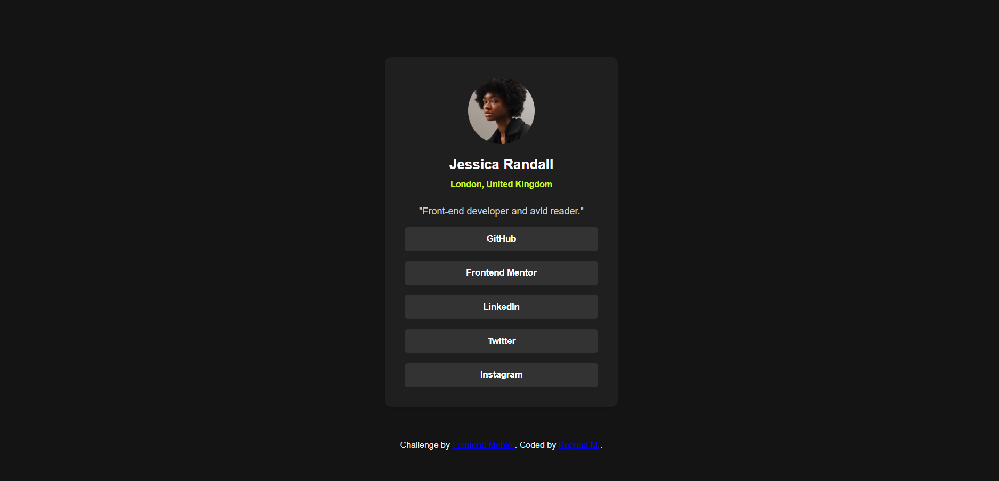

# Frontend Mentor - Social Links Profile

This is a solution to the [Social Links Profile challenge on Frontend Mentor](https://www.frontendmentor.io/challenges/social-links-profile-UG32l9m6dQ). Frontend Mentor challenges help you improve your front-end coding skills by building real projects.

## 📌 Table of Contents

* [Overview](#overview)

  * [The Challenge](#the-challenge)
  * [Screenshot](#screenshot)
  * [Links](#links)
* [My Process](#my-process)

  * [Built With](#built-with)
  * [What I Learned](#what-i-learned)
  * [Useful Resources](#useful-resources)
* [Author](#author)

---

## 📝 Overview

### ✅ The Challenge

Users should be able to:

* View a profile card with avatar, name, location, and social links
* See hover and focus states for all interactive elements

### 📸 Screenshot

### 🔗 Links

* **Solution URL:** [View on Frontend Mentor](https://www.frontendmentor.io/solutions/social-media-links-profile-XNtnF7lLfu)
* **Live Site URL:** [View Live Site](https://raghadm25.github.io/social-links-profile/)

---

## ⚙️ My Process

### 🛠️ Built With

* Semantic HTML5
* CSS custom properties (variables)
* Flexbox

### 💡 What I Learned

This project helped me practice:

* Structuring a clean and responsive layout
* Styling interactive elements (hover, focus)
* Using custom properties for consistent design

### Useful resources:

Frontend Mentor Help Center – Great advice on submission and structure.
MDN Web Docs – My go-to for HTML/CSS documentation.

## 👩‍💻 Author

* Frontend Mentor – [@raghadm25](https://www.frontendmentor.io/profile/raghadm25)
* GitHub – [@raghadm25](https://github.com/raghadm25)

---
### Acknowlegements 

Thanks to Frontend Mentor for providing a great design challenge. This project was a fun way to improve my frontend fundamentals and attention to detail!